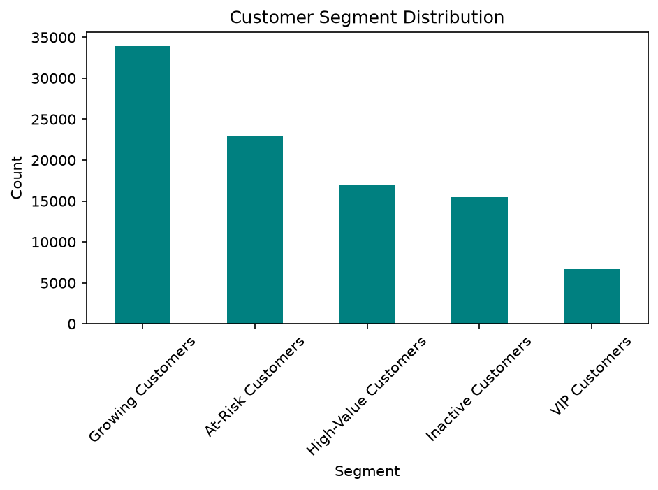
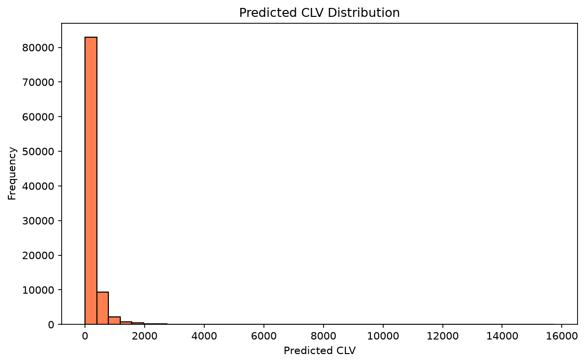
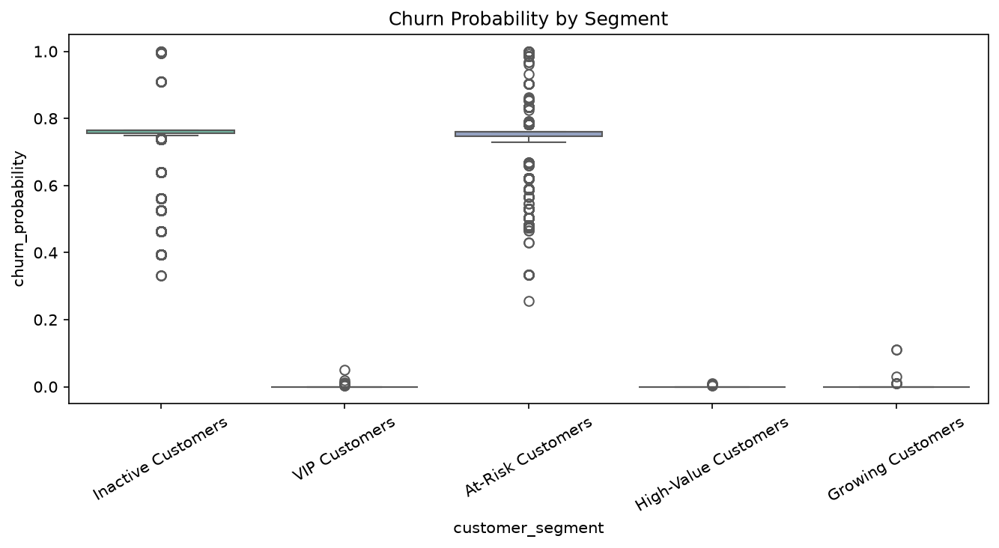
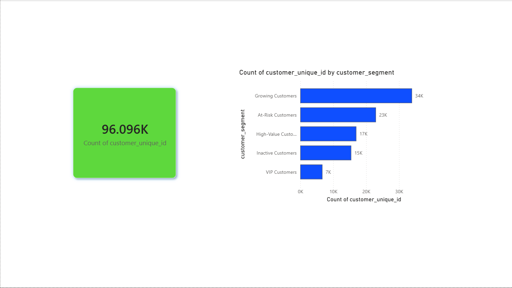
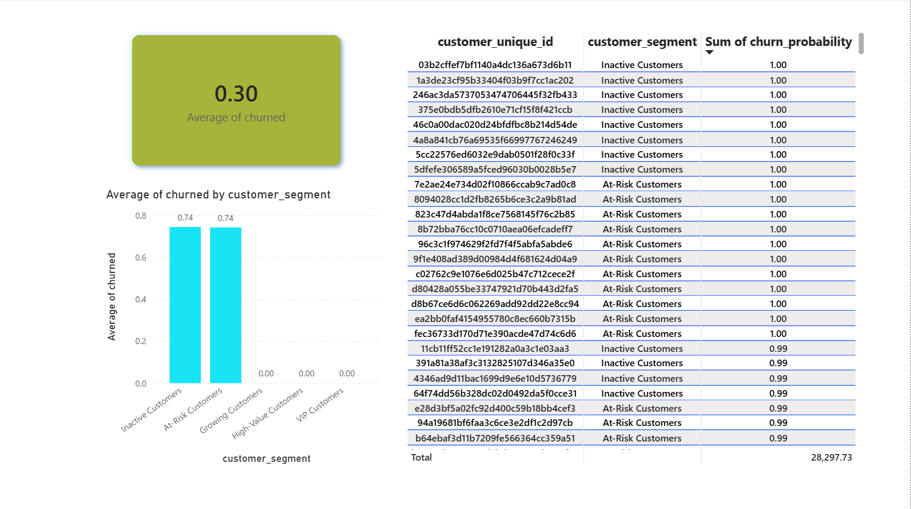
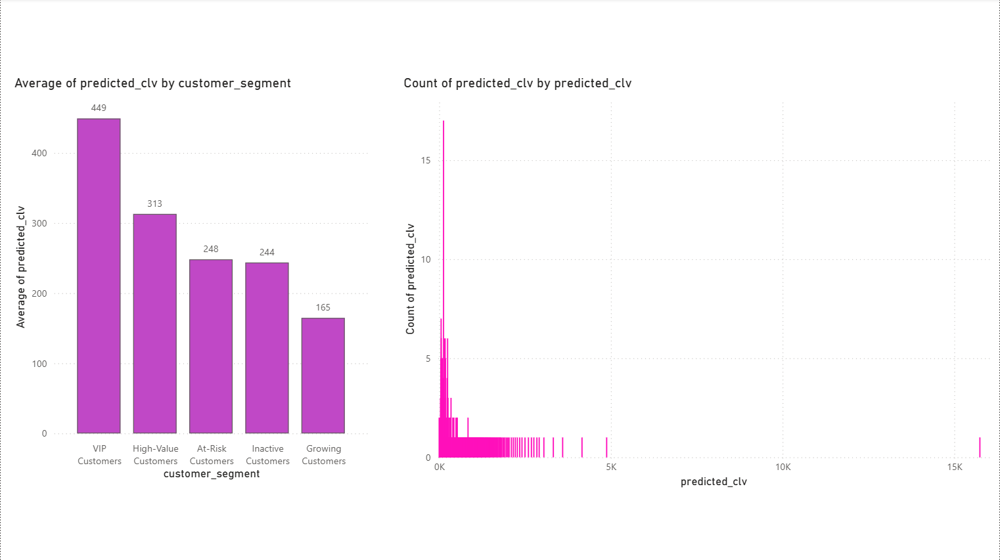
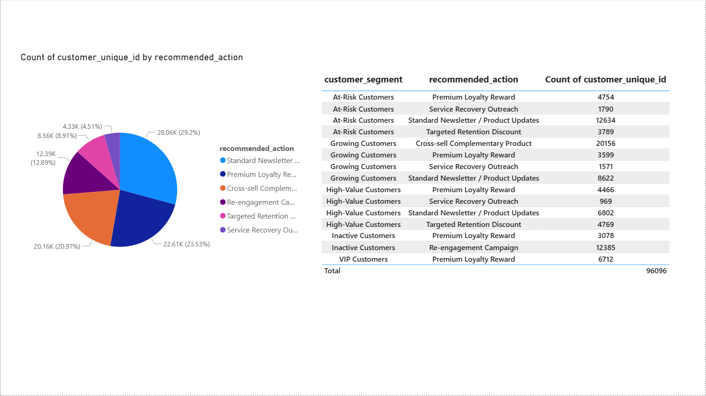

# Customer 360 & Next-Best-Action Engine

An end-to-end customer analytics pipeline built on the Olist e-commerce dataset — covering RFM segmentation, churn prediction, customer lifetime value (CLV), purchase prediction, and a next-best-action recommendation engine, visualized in Power BI.

## Overview

This project simulates a real-world customer intelligence system: identifying who your customers are, predicting who's likely to churn, estimating their long-term value, and recommending the best next action to retain or grow them.

## Tech Stack

- **Python** — data cleaning, EDA, feature engineering, ML models
- **SQL** — data querying and transformation
- **Power BI** — interactive dashboard and DAX measures
- **Machine Learning** — churn classification, CLV estimation, purchase prediction

## Pipeline

1. Data cleaning & EDA
2. RFM (Recency, Frequency, Monetary) customer segmentation
3. Churn prediction model
4. CLV estimation
5. Purchase prediction model
6. Next-Best-Action recommendation engine
7. Power BI dashboard

## Key Insights

## Dashboard Preview

## Dataset

[Olist Brazilian E-Commerce Public Dataset](https://www.kaggle.com/datasets/olistbr/brazilian-ecommerce)

## Author

Subham Pattnaik
[LinkedIn](https://linkedin.com/in/subham-pattnaik-0738bb324)